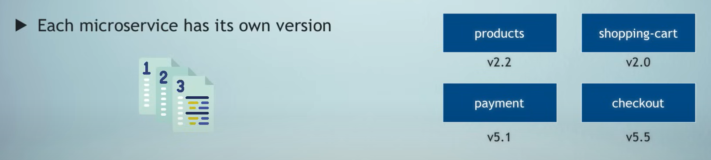
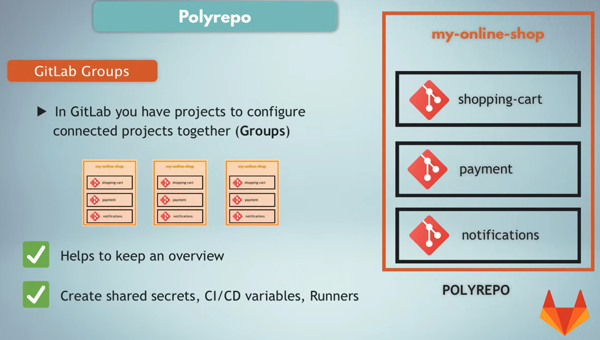

# Microservices

## Micro simplified :

- resource: https://www.youtube.com/watch?v=lL_j7ilk7rc&ab_channel=5MinutesorLess

- architecture paradigm that address the limitations of legacy application.
- monolethic => multitier => microservices. 

### Monolethic App:

- straightforward day to build a simple app where u design a single piece of code encapsulating data storage and access, business logic and processes, and user interfaces. 

- limitations when building complex systems, since everything is tangled together, it becames difficult to mantain, evolve and scale.

### Multitier architecture:

- architecture components are separated into layers based on technical functions.
common model three-tier archi.

- presentation layer (frontend): covers code and components responsible for interaction with usecrs through user interfaces.
- logic layer (backend): business logic and processes, relative to business functions.
- data layer: storing, accessing and retrieving data when needed.

- separting logic and data made things better, it was still a centralized way to designing application and still monolethic.

### Microservices:

- best way to tackle complexity is by decomposing it into manageable chunks, breaking everything into smaller pieces.

- every microservice deals with one business function, end to end independently from other microservices, they present simple easy to understand apis (API Gateway), and communicate with eachother through common protocols like HTTP

- when an app is designed with microservices, different teams can work separatly and indefrently on different microservices, theoratically teams could use different programming languages and deploy their microservices to different infrastructre, however, for cost reduction, operational optimization, efficiency improvement, we limit our team choices to a set of approved tools, infra providers (clouds), programming languages.
- deploy in this screenshot is done via CI/CD.

- to manage the complexity of the highly distributed microservices, we have solutions like containerazition, container orchestration, pipeline automation for CI/CD, asynchronous messaging for message brokers and queus (kafka), performance monitoring (prometheues) to track microservice performance, logging and audit tools that helps track everyhting within the system(datadog).

## Microservices explained - the What, Why and How?

- resource: https://www.youtube.com/watch?v=rv4LlmLmVWk&ab_channel=TechWorldwithNana

### Monolethic and its downsides:

* drawbacks of monolethic:

* higher infra costs in terms of scaling

### Microservices solutions:

* answers to the micro questions: 

* note: Apps should be **Loosely Coupled**

* if you change something in one service, that only service will be built and deployed

* versioning for each service:

### Communications between services:

#### Communication using API calls (Synchronous Communication => send request and wait for response)

#### Communication using message broker (Asynchronous - eg: RabbitMQ)

#### Communication via Service Mesh (Used with K8S):

### Possible Downsides: 

* for example when configuring the communication between the services, a microservice may be down, unhealthy or just not ready and not responding yet (docker or k8s can solve this, by checking readiness and liveness ), while another service starts sending requests to its API expecting a fullfied response. 

### Tools to tackle these challenges: 

* we need tools for:
    - IaC (Terraform from Hashicorp)
    - security (Vault for secret management from Hashicorp)
    - orchestration (K8S)
    - containers
    - messaging
    - service mesh (apart from K8S, )
    - monitoring

### CI/CD Pipelines for Microservices:

* how to configure release process with a CI/CD pipeline for microservices.
* maybe each microservice in CICD???

### Monorepo vs Polyrepo(how code in managed in Microservices Archi):

#### Monorepo:

* 1 git repo that contains many projects.

* Monorepo issues:

* in most CICD platform, you can only create one pipeline per project, and we are building multiple projects with a single pipeline, that could prompt us to write additional logic in the pipleline code to isolate only the sections that were update, but that's not the best practice. 

#### Polyrepo:

* can you something like **Gitlab Groups** to configure projects together.

* as a result, we can have multiple piple for each service

* poly issues

# API(Application Programming Interface):

## API Definition:

* resource: https://aws.amazon.com/what-is/api/
* resource: https://www.freecodecamp.org/news/learn-api-fundamentals-and-architecture/

* Mechanism that enable two software components to communicate with eachother using a set of rules and protocols.

* The word Application refers to any software with a distinct function.
* Interface a contract of service between two applications, this contract define how the two communicate with eachother using requests and responses.
* Their API documentation contains information on how developers are to structure those requests and responses.

## How Do APIs work: 

* Client (App that sends request) <==> Server (App that sends response)

* four ways an api can work:
    - SOAP APIs (uses XML).
    - RPC APIs.
    - Websocket APIs (Important: Uses JSON Objects to pass data, supports two way communication between client apps and servers. check :https://docs.aws.amazon.com/apigateway/latest/developerguide/apigateway-websocket-api-overview.html#:~:text=The%20WebSocket%20API%20invokes%20your,callback%20messages%20to%20connected%20clients.)
    - REST APIs.

## Types of APIs:

## Types of APIs Architecture:

1. REST APIs.
2. SOAP APIs.
3. GraphQL APIs.
3. gRPC APIs.

### REST API:

* Representational State Transfer is an architectural design that uses HTTP Methods (GET, POST, PUT, DELETE) to perform CRUD Operations (Create, Read, Update, Delete).

#### Key Components:

1. Resources and Endpoints:
    - Endpoints or entities exposed by the API can include anything (users, products...)
    - Each Resource is identified by a unique URI.

2. HTTP Methods.

3. Data Representation: 
    - Use JSON Objects, XML...
    - API Responds with the requested representation.

4. HTTP Headers and query parameters (used for authentication, content negotiation...).

4. Statelessness and Cacheability. (resource: https://apipark.com/techblog/en/understanding-stateless-vs-cacheable-key-differences-explained/)

