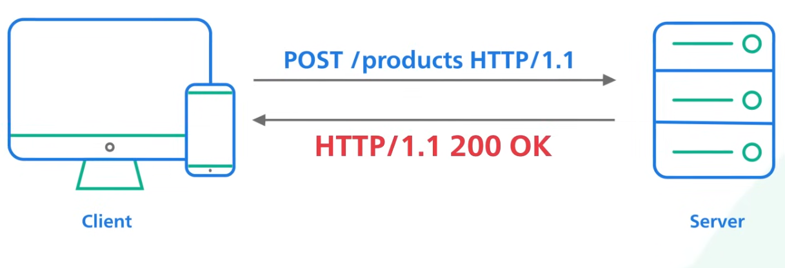

# API Design and Architecture: 

- useful resource: https://www.freecodecamp.org/news/learn-api-fundamentals-and-architecture/
- resource: https://www.youtube.com/watch?v=WXsD0ZgxjRw

## What's REST API and how to use it:

- resource: https://restfulapi.net/rest-architectural-constraints/
- resource: https://www.youtube.com/watch?v=-mN3VyJuCjM&list=PLCRMIe5FDPsd0gVs500xeOewfySTsmEjf&index=5

- REST is a set of rules that has been common standard for building web API.

### REST API Basics:

-  A RESTful API  organizes resources into a set of unique URIs,or Uniform Resource Identifiers. The URIs differentiate different types of resources on a server. Here are some examples:

- The resources  should be grouped by noun and not verb.
- An API to get all products should be slash products and not slash getAllProducts.

- A client interacts with a resource by making a request to the endpoint for  the resource over HTTP. The request has a very specific format, as shown here. The line contains  the URI for the resource we'd like to access. The URI is preceded by an HTTP verb which tells  the server what we want to do with the resource.

- RESRT CRUD Operations on resources:

- In the body of these requests, there could be an optional HTTP request body that contains a custom payload of data, usually encoded in JSON. The server receives a request, processes it, and formats the result into a response. The first  line of the response contains the HTTP status code to tell the client what happened to the request.

### HTTP Status Code:

- A well-implemented RESTful API returns proper HTTP Status Code.

### REST Stateless: 

- A REST implementation should be stateless. It  means the two parties don't need to store any information about each other, and every request and response (cycle) is independent from all others. This leads to web applications that are easy to  scale and well behaved.

- Cacheability vs Stateles:
    * https://stackoverflow.com/questions/63722192/how-come-server-is-supposed-to-cache-information-in-rest-apis

### Pagination: 

- If an API endpoint returns a huge amount of data, use Pagination.

- A common pagination scheme  uses "limit" and "offset" as parameters.
- If they are not specified, the server  should assume sensible default values.

### API Versioning:

- Versioning allows an implementation to provide backward compatibility, so that if we introduce breaking changes from one version to another, consumers can get enough time to move to the next version. There are many ways to version an API. The most straightforward is to prefix the version before  the resource on the URI.

