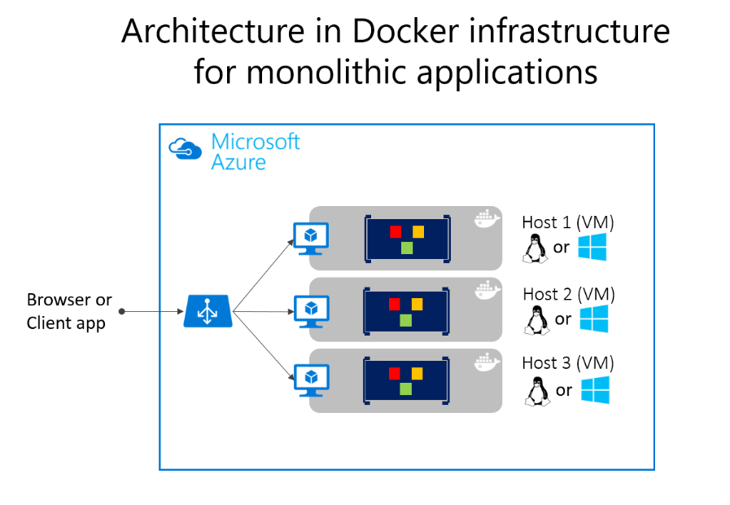
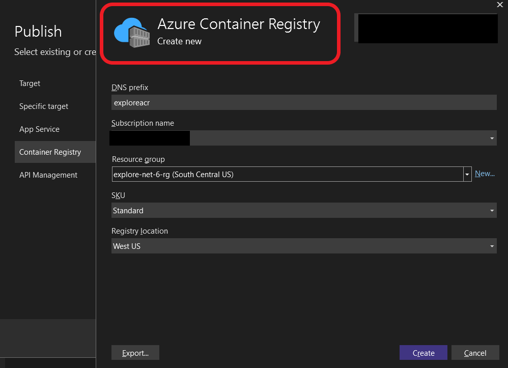
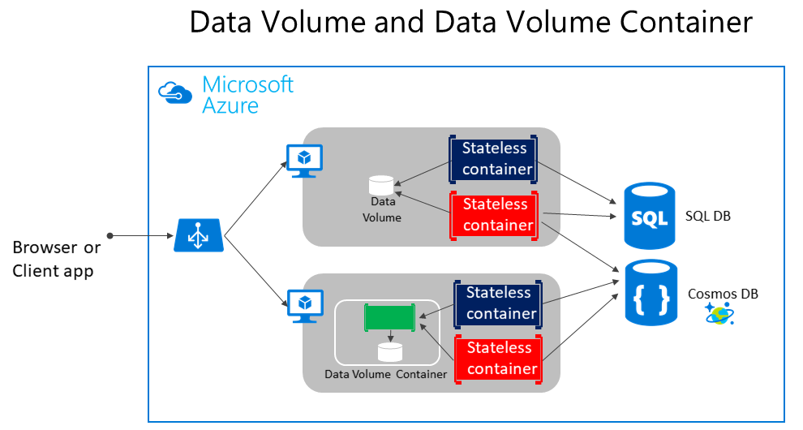
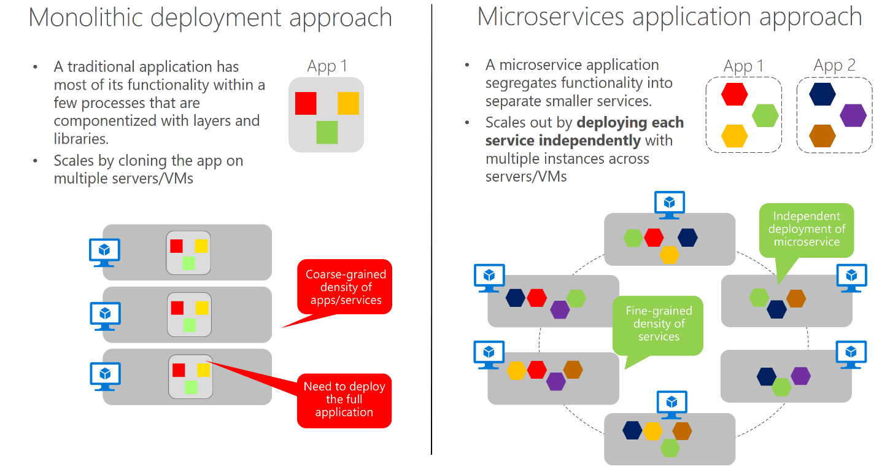
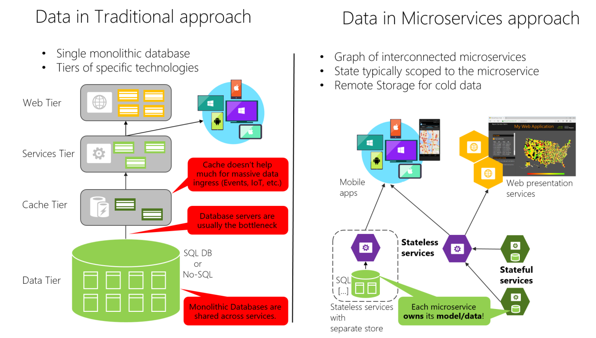
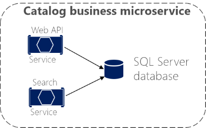
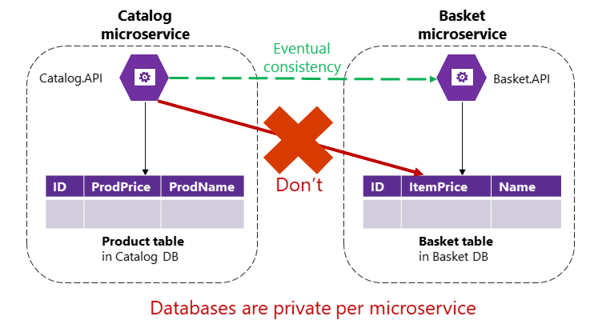

# Net Microservices
## Chap3: Architecting container and microservice-based applications

- **Microservice architecture patterns are essential** for building scalable, maintainable applications.  
- **Containers are helpful but not required** for microservices—they're just a good fit.  
- **Understanding Domain-Driven Design (DDD) patterns and container orchestration** is crucial for handling complex, enterprise-level applications.  
- The guide emphasizes the **intersection of microservices and containers**, reflecting real-world usage.  

### Container Design Principles:

- **Each container should represent a single process**—this defines a clear process boundary.
- The **`ENTRYPOINT` in a Dockerfile** defines the main process that controls the container's lifecycle.
- **When the process ends or fails, the container stops**, and the **orchestrator** (like Kubernetes) may restart it.
- Containers can be used for both:
  - **Long-running processes** (e.g., web servers)
  - **Short-lived batch jobs**
- **Orchestrators manage container failures and scaling**, ensuring availability and reliability.
- **Running multiple processes in one container is possible**, but it's **uncommon and not recommended**—better to use one process per container for simplicity and scalability.

### Containerizing monolithic applications:



- A **monolithic application** can be deployed as a **single container**, even if it has multiple internal layers (e.g., application, domain, data access).
- **Scaling is done by cloning the container** and using a load balancer—simple, but coarse-grained.
- This approach **conflicts with the container principle**: *“a container does one thing in one process”*, but can still be acceptable in some scenarios.
- **Scaling issues** arise when only part of the app needs more resources—monoliths force **scaling everything**, leading to inefficiency.
- **Changing one component requires full redeployment and retesting**, increasing complexity as the app grows.
- Despite drawbacks, **monolithic apps are common** due to simpler development and historical infrastructure/tooling limitations.
- Platforms like **Azure App Service and Azure VM Scale Sets** support scaling monolithic apps easily, including those in Docker containers.
- Monolithic deployment is manageable using traditional methods (e.g., `docker run`, `docker-compose`) or modern CD pipelines. 

### Deploying a monolithic application as a container:

- **Containers simplify and speed up scaling** compared to traditional VMs.
- **Docker images start quickly** (in seconds), making rollouts and updates much faster.
- **Stopping and restarting containers is fast and easy** (e.g., `docker stop`).
- **Containers are immutable**, reducing risks of configuration drift or corruption common with VMs.
- **Deploying updates via Docker images** is more efficient and consistent than using update scripts on VMs.
- **Container orchestrators add more benefits**, like managing container lifecycles and scaling.
- **Breaking down the monolith into subsystems** is the first step toward transitioning to **microservices**. 

### Publishing a single-container-based application to Azure App Service



- **Azure App Service supports scalable single-container deployments**, ideal for validation or production use.
- **Integration with Git and Visual Studio** makes it easy to build and deploy directly to Azure.
- **Before container support**, you were limited by the dependencies supported in App Service.
- **With containers, you can include any required dependencies** in your Dockerfile/image.
- **Visual Studio (2017+) supports containerized deployments**, offering flexibility and control.
- **Images are published through a container registry**, such as:
  - **Azure Container Registry** (secure and Azure-integrated)
  - **Docker Hub** or other registries (including on-premises ones)

### Manage State and Data in Docker Applications:



- **Containers are ephemeral**: Data inside a container is temporary and not persistent.
- **Docker Volumes**: Preferred method for persistent data. They are isolated from the host and can outlast the container’s lifecycle.
- **Bind Mounts**: Allow containers to access specific host directories, but less secure and prone to data inconsistencies.
- **tmpfs Mounts**: Store data in memory, fast but non-persistent.
- **Remote Storage Options**: Use cloud services like **Azure Storage**, **SQL databases**, or **NoSQL databases** for persistent, critical data.
- **Best Practice**: Use Docker volumes for non-critical state and rely on remote storage for important data.

### Service-oriented architecture:

- **SOA Overview**: SOA decomposes applications into multiple services (typically HTTP services) that are categorized into subsystems or tiers.
- **SOA with Docker**: Docker containers help with deployment by bundling dependencies within the container image.
- **Scaling SOA**: Single Docker hosts may face scalability and availability challenges; clustering or orchestrators help address these issues.
- **SOA vs. Microservices**: Microservices come from SOA but avoid common SOA patterns (e.g., central brokers, Enterprise Service Bus). Microservices are considered a refined version of SOA.
- **Focus on Microservices**: This guide emphasizes microservices due to their more prescriptive requirements compared to SOA.

### Microservices architecture:



- **Definition**: Microservices architecture builds applications as a set of small, independent services. Each service:
  - Runs in its own process
  - Communicates via HTTP/HTTPS, WebSockets, or AMQP
  - Has its own domain data, logic, and storage (SQL/NoSQL)

- **Key Principles**:
  - Focus on **loose coupling** and **high cohesion**, not size
  - Services should be **autonomous**, **independently deployable**, and **individually scalable**

- **Benefits**:
  - Better maintainability for complex, scalable systems
  - Independent scaling reduces cost (scale only what’s needed)
  - Faster development and deployment
  - Supports CI/CD and agile practices
  - Enables isolated testing and evolution of services without breaking others

- **Monolith vs. Microservices**:
  - Monolith: scale whole app
  - Microservices: scale only required services → more efficient and agile

- **Production Success Factors**:
  - Service and infrastructure monitoring
  - Scalable cloud infrastructure and orchestrators
  - Robust security: auth, secrets, secure comms
  - DevOps practices and rapid delivery pipelines

### Data sovereignty per microservice:



- **Data ownership**: Each microservice must **own its own data and logic**, with an independent lifecycle and deployment.

- **Bounded Contexts (DDD)**: Each microservice represents a specific business domain (bounded context) and maintains its own domain model.

- **Monolithic vs. Microservice Data**:
  - *Monolithic*: Single centralized SQL database, easier for cross-table queries, but leads to tightly coupled systems and massive, bloated tables.
  - *Microservices*: Each service has its **own isolated database**, promoting autonomy and scalability.

- **Data Access in Microservices**:
  - Data is private to each microservice.
  - Shared access must go through **APIs (REST, gRPC, SOAP)** or **messaging (AMQP, etc.)**.
  - Prevents tight coupling and allows independent evolution.

- **Trade-offs**:
  - Lose ability for ACID transactions across services → must use **eventual consistency** for multi-service workflows.
  - Can't do distributed SQL joins or constraints across microservices.

- **Polyglot Persistence**:
  - Microservices can use **different types of databases** (SQL, NoSQL) depending on needs.
  - Enables better **performance**, **scalability**, and **manageability**, but adds **complexity** in data coordination.

#### The relationship bettween Microservices and the Bounded Context:

- **Bounded Contexts**:
  - Divide large domain models into **distinct, well-defined areas**.
  - Each has **its own model, database**, and **ubiquitous language** (terms used consistently by devs and domain experts).
  - Terms can vary across contexts even if they represent the same identity (e.g., *User* in one BC may be *Buyer* in another).

- **Microservices = Bounded Contexts as distributed services**:
  - Each microservice aligns with a BC and is deployed as a **separate process**.
  - Communicates via **distributed protocols** (HTTP, WebSockets, AMQP, etc.).

- **Difference**:
  - BCs don't require distribution—they can exist inside a monolithic app.
  - Microservices enforce distribution and independence.

- **Design tip**:
  - It's smart to align one microservice per Bounded Context.
  - But flexibility exists—some BCs may consist of **multiple microservices**.

- **Shared principle**:
  - Both patterns emphasize **owning the domain model** and **not sharing it across services**.

### Logical Architecture vs Physical Architecture:



- **Microservices = Logical Architecture**
  - Microservices are about **designing your app's structure**, not about a specific technology.
  - They can be run as containers, processes, or any other form—**Docker is not required**.

- **Logical vs. Physical**:
  - **Logical architecture**: How your system is structured conceptually (e.g., business microservices or Bounded Contexts).
  - **Physical architecture**: How it's actually **deployed or hosted** (e.g., number of services, containers, infrastructure setup).
  - These two don't always match 1-to-1.

- **Flexible Implementation**:
  - A **single logical microservice** might map to:
    - One physical service or container (common case).
    - **Multiple services**, processes, or containers (especially in large, complex systems).

- **Why split a logical service into multiple physical services?**
  - For **scaling** (e.g., Web API vs. Search service needing different compute resources).
  - For **deployment independence** within the same business domain.
  - As long as they share the same **data model** and serve the same domain, it's fine.

- **Main takeaway**:
  - Logical microservices are defined by **domain autonomy** and **independent deployment/versioning**, not by how many services or containers exist physically.

#### Example: Catalog Microservice in an E-commerce Platform

##### Logical Architecture:
You define a single business microservice called `Catalog` that handles:
- Product and category management  
- Serving product metadata to other services

This is the **logical microservice**. It owns its data, domain logic, and has its own bounded context.

---

##### Physical Architecture Options

**Option 1: One-to-One Mapping**  
`Catalog` is implemented as a single service:

```
Logical Catalog Microservice
└── Physical Service: catalog-service (REST API)
    └── Database: catalog-db
```

**Option 2: One-to-Many Mapping**  
As the system scales, the Catalog microservice is split into multiple physical services:

```
Logical Catalog Microservice
├── catalog-api-service (admin/product management)
├── catalog-search-service (optimized for read/search operations)
├── catalog-image-service (serves product images)
└── Shared database or separate stores where appropriate
```

- `catalog-api-service`: Handles product updates by admins.
- `catalog-search-service`: Scales independently to handle customer queries.
- `catalog-image-service`: Delivers images, possibly using a CDN or blob storage.

Each service is a separate process or container but remains part of the same logical Catalog microservice.

---

##### Key Point:
Logical microservices define business capabilities and boundaries, while physical services represent the actual deployed units. One logical microservice can map to one or multiple physical services depending on scalability and deployment needs.

### Challenges and Solutions for distributed data management:
#### Chal1: How to define the boundaries of each microservice

- The first challenge in microservice architecture is identifying the right boundaries for each service. This starts with analyzing the **logical domain models** of the application.

##### Key Guidelines:
- Look for **independent contexts** with minimal data and logic coupling.
- Identify areas with **different business vocabularies** (e.g., "User" vs "Customer" vs "Buyer")—even if they refer to the same person, they serve different roles in different contexts.
- Each **Bounded Context** should encapsulate its own data and domain logic.
- Boundaries should reflect real business divisions, allowing services to evolve independently.

##### Example:
- **Identity Context**: Manages users and authentication (`User`)
- **CRM Context**: Manages customer relationships (`Customer`)
- **Ordering Context**: Handles purchases (`Buyer`)

Each of these would become a separate microservice, based on its domain responsibilities.

#### Chal2: How to create queries that retrieve data from several microservices

When data is spread across several microservices, aggregating it efficiently becomes a challenge—especially for client apps that need data from many services (e.g., a mobile screen showing user, basket, and catalog info).

##### Solutions:

- **API Gateway**  
  Aggregate data from multiple services through a central entry point. Use separate, domain-focused gateways to avoid bottlenecks and preserve microservice autonomy.

- **GraphQL Federation**  
  Compose data from different services into a unified GraphQL schema, allowing flexible client-side queries across microservices.

- **CQRS with Materialized Views**  
  Pre-generate read-optimized, denormalized tables that combine data from various services. Ideal for performance and complex UI screens. Trades off real-time consistency for speed and scalability.

- **Cold Data in Central Databases**  
  For analytics and reporting, export data into a central warehouse (e.g., Hadoop, Azure SQL DW). Used only for queries, not for transactional updates. Updated via events or import/export processes.

##### Design Tip:
If your app frequently needs to join data from multiple microservices in real time, it might indicate a design issue—consider merging those services or re-evaluating boundaries.

#### Chal3: How to achieve consistency across multiple microservices



In microservices, each service owns its data and must expose it only via its API. This makes ensuring consistency across services a key challenge—especially during cross-service business processes.

##### Example:
- **Catalog Service** updates a product's price.
- **Basket Service** stores previously added items with the old price.
- When the price changes, baskets containing the item should be updated, and users notified.

##### In a Monolith:
A single ACID transaction would update both tables directly.

##### In Microservices:
Direct database access between services is not allowed. Instead, consistency must be **eventual**, using asynchronous communication.

##### Solutions:

- **Event-Driven Communication**  
  Use integration events to inform other services of changes (e.g., Catalog emits a `ProductPriceChanged` event, and Basket updates accordingly).

- **Publish/Subscribe Messaging**  
  Services publish events and others subscribe to relevant changes to update their own state asynchronously.

- **Trade-offs** (based on the CAP theorem):  
  Microservices prioritize **availability and scalability** over strong consistency. Developers must handle **eventual consistency** through logic in the consuming services.

##### Important Note:
Two-phase commits or distributed transactions are discouraged—they break microservices principles and aren’t supported by many NoSQL systems.

#### Chal4: How to design communication across microservice boundaries

- In microservices, **how services communicate** is as important as **what protocol** they use. The focus is on **communication style and coupling**, not just REST, HTTP, or messaging.

##### Problem:
- Distributed systems are prone to **partial failures**.
- Designing microservices like tightly coupled objects (as in a monolith) leads to **fragile chains** of dependencies.

##### Example Pitfall:
A client sends an HTTP request to `Ordering` → which calls `Payment` → which calls `Inventory`, all **synchronously**.  
If **any service fails**, the whole chain breaks. This leads to:
- **Blocking & Performance issues**: The original request waits for all calls to finish.
- **Tight Coupling**: Services rely on others, violating autonomy.
- **Brittleness**: A single point of failure breaks the workflow.

##### Recommendation:
- Avoid chaining synchronous HTTP calls between microservices.
- Use **asynchronous communication** between services:
  - Message-based communication (e.g., with queues or event buses).
  - Event-driven architecture (publish/subscribe).
  - If HTTP is used, **decouple the call** from the request/response cycle (e.g., via polling or async updates).

> TL;DR: Chains of synchronous calls = hidden monolith. Use **async patterns** to boost resiliency and maintain microservice autonomy.

##### **Bad Example: Synchronous HTTP Chain**
Let’s say you’re placing an order in an e-commerce app:

```plaintext
Client --> Ordering Service --> Payment Service --> Inventory Service
```

All of these are **synchronous HTTP calls**.  
If `Inventory Service` is slow or down, **everything blocks** — and the client gets an error or timeout.  
This is fragile, tightly coupled, and hard to scale.

---

##### **Good Example: Asynchronous Communication Using Events**

```plaintext
Client --> Ordering Service
Ordering Service --> [Publish OrderCreated Event]
        |
        +--> Payment Service (subscribed to OrderCreated)
        +--> Inventory Service (subscribed to OrderCreated)
```

- `Ordering Service` **publishes an event** like `OrderCreated` to a message broker (e.g., RabbitMQ, Kafka, or Azure Service Bus).
- `Payment Service` and `Inventory Service` **subscribe** to this event and process it **independently and asynchronously**.
- If any service is down, the message can be retried later — no blocking, no broken chains.

---

##### Bonus
You can also add an **Orchestrator Service** or use **Saga patterns** for more complex workflows (like compensation logic when something fails).

