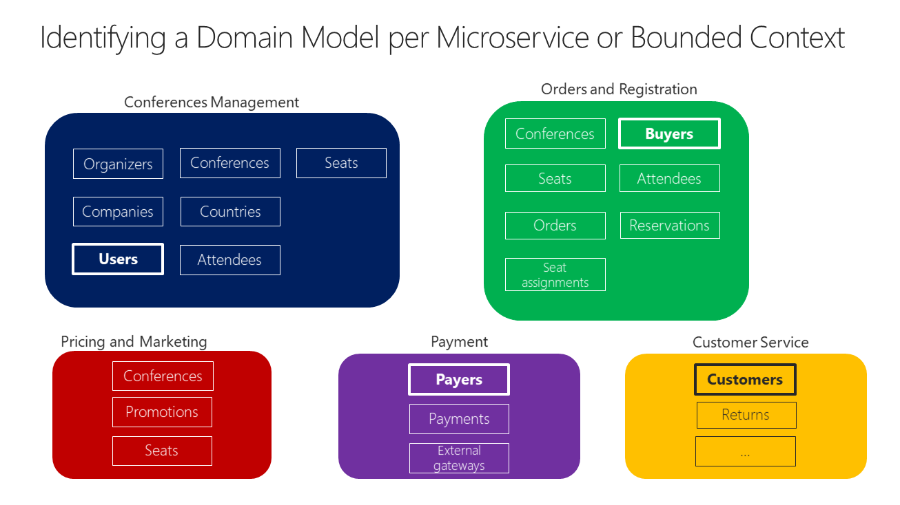
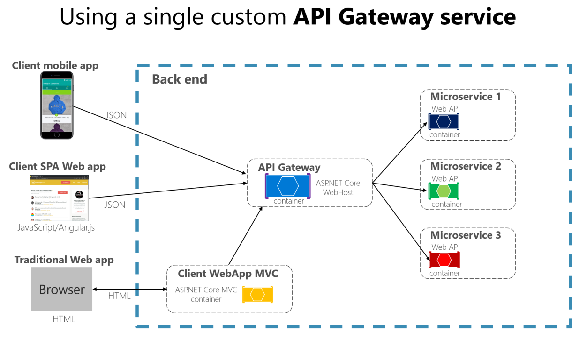

# Net Microservices
## Chap3: Architecting container and microservice-based applications

- **Microservice architecture patterns are essential** for building scalable, maintainable applications.  
- **Containers are helpful but not required** for microservices—they're just a good fit.  
- **Understanding Domain-Driven Design (DDD) patterns and container orchestration** is crucial for handling complex, enterprise-level applications.  
- The guide emphasizes the **intersection of microservices and containers**, reflecting real-world usage.  

### Container Design Principles:

- **Each container should represent a single process**—this defines a clear process boundary.
- The **`ENTRYPOINT` in a Dockerfile** defines the main process that controls the container's lifecycle.
- **When the process ends or fails, the container stops**, and the **orchestrator** (like Kubernetes) may restart it.
- Containers can be used for both:
  - **Long-running processes** (e.g., web servers)
  - **Short-lived batch jobs**
- **Orchestrators manage container failures and scaling**, ensuring availability and reliability.
- **Running multiple processes in one container is possible**, but it's **uncommon and not recommended**—better to use one process per container for simplicity and scalability.

### Containerizing monolithic applications:


- A **monolithic application** can be deployed as a **single container**, even if it has multiple internal layers (e.g., application, domain, data access).
- **Scaling is done by cloning the container** and using a load balancer—simple, but coarse-grained.
- This approach **conflicts with the container principle**: *“a container does one thing in one process”*, but can still be acceptable in some scenarios.
- **Scaling issues** arise when only part of the app needs more resources—monoliths force **scaling everything**, leading to inefficiency.
- **Changing one component requires full redeployment and retesting**, increasing complexity as the app grows.
- Despite drawbacks, **monolithic apps are common** due to simpler development and historical infrastructure/tooling limitations.
- Platforms like **Azure App Service and Azure VM Scale Sets** support scaling monolithic apps easily, including those in Docker containers.
- Monolithic deployment is manageable using traditional methods (e.g., `docker run`, `docker-compose`) or modern CD pipelines. 

### Deploying a monolithic application as a container:

- **Containers simplify and speed up scaling** compared to traditional VMs.
- **Docker images start quickly** (in seconds), making rollouts and updates much faster.
- **Stopping and restarting containers is fast and easy** (e.g., `docker stop`).
- **Containers are immutable**, reducing risks of configuration drift or corruption common with VMs.
- **Deploying updates via Docker images** is more efficient and consistent than using update scripts on VMs.
- **Container orchestrators add more benefits**, like managing container lifecycles and scaling.
- **Breaking down the monolith into subsystems** is the first step toward transitioning to **microservices**. 

### Publishing a single-container-based application to Azure App Service


- **Azure App Service supports scalable single-container deployments**, ideal for validation or production use.
- **Integration with Git and Visual Studio** makes it easy to build and deploy directly to Azure.
- **Before container support**, you were limited by the dependencies supported in App Service.
- **With containers, you can include any required dependencies** in your Dockerfile/image.
- **Visual Studio (2017+) supports containerized deployments**, offering flexibility and control.
- **Images are published through a container registry**, such as:
  - **Azure Container Registry** (secure and Azure-integrated)
  - **Docker Hub** or other registries (including on-premises ones)

### Manage State and Data in Docker Applications:


- **Containers are ephemeral**: Data inside a container is temporary and not persistent.
- **Docker Volumes**: Preferred method for persistent data. They are isolated from the host and can outlast the container’s lifecycle.
- **Bind Mounts**: Allow containers to access specific host directories, but less secure and prone to data inconsistencies.
- **tmpfs Mounts**: Store data in memory, fast but non-persistent.
- **Remote Storage Options**: Use cloud services like **Azure Storage**, **SQL databases**, or **NoSQL databases** for persistent, critical data.
- **Best Practice**: Use Docker volumes for non-critical state and rely on remote storage for important data.

### Service-oriented architecture:

- **SOA Overview**: SOA decomposes applications into multiple services (typically HTTP services) that are categorized into subsystems or tiers.
- **SOA with Docker**: Docker containers help with deployment by bundling dependencies within the container image.
- **Scaling SOA**: Single Docker hosts may face scalability and availability challenges; clustering or orchestrators help address these issues.
- **SOA vs. Microservices**: Microservices come from SOA but avoid common SOA patterns (e.g., central brokers, Enterprise Service Bus). Microservices are considered a refined version of SOA.
- **Focus on Microservices**: This guide emphasizes microservices due to their more prescriptive requirements compared to SOA.

### Microservices architecture:


- **Definition**: Microservices architecture builds applications as a set of small, independent services. Each service:
  - Runs in its own process
  - Communicates via HTTP/HTTPS, WebSockets, or AMQP
  - Has its own domain data, logic, and storage (SQL/NoSQL)

- **Key Principles**:
  - Focus on **loose coupling** and **high cohesion**, not size
  - Services should be **autonomous**, **independently deployable**, and **individually scalable**

- **Benefits**:
  - Better maintainability for complex, scalable systems
  - Independent scaling reduces cost (scale only what’s needed)
  - Faster development and deployment
  - Supports CI/CD and agile practices
  - Enables isolated testing and evolution of services without breaking others

- **Monolith vs. Microservices**:
  - Monolith: scale whole app
  - Microservices: scale only required services → more efficient and agile

- **Production Success Factors**:
  - Service and infrastructure monitoring
  - Scalable cloud infrastructure and orchestrators
  - Robust security: auth, secrets, secure comms
  - DevOps practices and rapid delivery pipelines

### Data sovereignty per microservice:


- **Data ownership**: Each microservice must **own its own data and logic**, with an independent lifecycle and deployment.

- **Bounded Contexts (DDD)**: Each microservice represents a specific business domain (bounded context) and maintains its own domain model.

- **Monolithic vs. Microservice Data**:
  - *Monolithic*: Single centralized SQL database, easier for cross-table queries, but leads to tightly coupled systems and massive, bloated tables.
  - *Microservices*: Each service has its **own isolated database**, promoting autonomy and scalability.

- **Data Access in Microservices**:
  - Data is private to each microservice.
  - Shared access must go through **APIs (REST, gRPC, SOAP)** or **messaging (AMQP, etc.)**.
  - Prevents tight coupling and allows independent evolution.

- **Trade-offs**:
  - Lose ability for ACID transactions across services → must use **eventual consistency** for multi-service workflows.
  - Can't do distributed SQL joins or constraints across microservices.

- **Polyglot Persistence**:
  - Microservices can use **different types of databases** (SQL, NoSQL) depending on needs.
  - Enables better **performance**, **scalability**, and **manageability**, but adds **complexity** in data coordination.

#### The relationship bettween Microservices and the Bounded Context:

- **Bounded Contexts**:
  - Divide large domain models into **distinct, well-defined areas**.
  - Each has **its own model, database**, and **ubiquitous language** (terms used consistently by devs and domain experts).
  - Terms can vary across contexts even if they represent the same identity (e.g., *User* in one BC may be *Buyer* in another).

- **Microservices = Bounded Contexts as distributed services**:
  - Each microservice aligns with a BC and is deployed as a **separate process**.
  - Communicates via **distributed protocols** (HTTP, WebSockets, AMQP, etc.).

- **Difference**:
  - BCs don't require distribution—they can exist inside a monolithic app.
  - Microservices enforce distribution and independence.

- **Design tip**:
  - It's smart to align one microservice per Bounded Context.
  - But flexibility exists—some BCs may consist of **multiple microservices**.

- **Shared principle**:
  - Both patterns emphasize **owning the domain model** and **not sharing it across services**.

### Logical Architecture vs Physical Architecture:


- **Microservices = Logical Architecture**
  - Microservices are about **designing your app's structure**, not about a specific technology.
  - They can be run as containers, processes, or any other form—**Docker is not required**.

- **Logical vs. Physical**:
  - **Logical architecture**: How your system is structured conceptually (e.g., business microservices or Bounded Contexts).
  - **Physical architecture**: How it's actually **deployed or hosted** (e.g., number of services, containers, infrastructure setup).
  - These two don't always match 1-to-1.

- **Flexible Implementation**:
  - A **single logical microservice** might map to:
    - One physical service or container (common case).
    - **Multiple services**, processes, or containers (especially in large, complex systems).

- **Why split a logical service into multiple physical services?**
  - For **scaling** (e.g., Web API vs. Search service needing different compute resources).
  - For **deployment independence** within the same business domain.
  - As long as they share the same **data model** and serve the same domain, it's fine.

- **Main takeaway**:
  - Logical microservices are defined by **domain autonomy** and **independent deployment/versioning**, not by how many services or containers exist physically.

#### Example: Catalog Microservice in an E-commerce Platform

##### Logical Architecture:
You define a single business microservice called `Catalog` that handles:
- Product and category management  
- Serving product metadata to other services

This is the **logical microservice**. It owns its data, domain logic, and has its own bounded context.

---

##### Physical Architecture Options

**Option 1: One-to-One Mapping**  
`Catalog` is implemented as a single service:

```
Logical Catalog Microservice
└── Physical Service: catalog-service (REST API)
    └── Database: catalog-db
```

**Option 2: One-to-Many Mapping**  
As the system scales, the Catalog microservice is split into multiple physical services:

```
Logical Catalog Microservice
├── catalog-api-service (admin/product management)
├── catalog-search-service (optimized for read/search operations)
├── catalog-image-service (serves product images)
└── Shared database or separate stores where appropriate
```

- `catalog-api-service`: Handles product updates by admins.
- `catalog-search-service`: Scales independently to handle customer queries.
- `catalog-image-service`: Delivers images, possibly using a CDN or blob storage.

Each service is a separate process or container but remains part of the same logical Catalog microservice.

---

##### Key Point:
Logical microservices define business capabilities and boundaries, while physical services represent the actual deployed units. One logical microservice can map to one or multiple physical services depending on scalability and deployment needs.

### Challenges and Solutions for distributed data management:
#### Chal1: How to define the boundaries of each microservice

- The first challenge in microservice architecture is identifying the right boundaries for each service. This starts with analyzing the **logical domain models** of the application.

##### Key Guidelines:
- Look for **independent contexts** with minimal data and logic coupling.
- Identify areas with **different business vocabularies** (e.g., "User" vs "Customer" vs "Buyer")—even if they refer to the same person, they serve different roles in different contexts.
- Each **Bounded Context** should encapsulate its own data and domain logic.
- Boundaries should reflect real business divisions, allowing services to evolve independently.

##### Example:
- **Identity Context**: Manages users and authentication (`User`)
- **CRM Context**: Manages customer relationships (`Customer`)
- **Ordering Context**: Handles purchases (`Buyer`)

Each of these would become a separate microservice, based on its domain responsibilities.

#### Chal2: How to create queries that retrieve data from several microservices

When data is spread across several microservices, aggregating it efficiently becomes a challenge—especially for client apps that need data from many services (e.g., a mobile screen showing user, basket, and catalog info).

##### Solutions:

- **API Gateway**  
  Aggregate data from multiple services through a central entry point. Use separate, domain-focused gateways to avoid bottlenecks and preserve microservice autonomy.

- **GraphQL Federation**  
  Compose data from different services into a unified GraphQL schema, allowing flexible client-side queries across microservices.

- **CQRS with Materialized Views**  
  Pre-generate read-optimized, denormalized tables that combine data from various services. Ideal for performance and complex UI screens. Trades off real-time consistency for speed and scalability.

- **Cold Data in Central Databases**  
  For analytics and reporting, export data into a central warehouse (e.g., Hadoop, Azure SQL DW). Used only for queries, not for transactional updates. Updated via events or import/export processes.

##### Design Tip:
If your app frequently needs to join data from multiple microservices in real time, it might indicate a design issue—consider merging those services or re-evaluating boundaries.

#### Chal3: How to achieve consistency across multiple microservices


In microservices, each service owns its data and must expose it only via its API. This makes ensuring consistency across services a key challenge—especially during cross-service business processes.

##### Example:
- **Catalog Service** updates a product's price.
- **Basket Service** stores previously added items with the old price.
- When the price changes, baskets containing the item should be updated, and users notified.

##### In a Monolith:
A single ACID transaction would update both tables directly.

##### In Microservices:
Direct database access between services is not allowed. Instead, consistency must be **eventual**, using asynchronous communication.

##### Solutions:

- **Event-Driven Communication**  
  Use integration events to inform other services of changes (e.g., Catalog emits a `ProductPriceChanged` event, and Basket updates accordingly).

- **Publish/Subscribe Messaging**  
  Services publish events and others subscribe to relevant changes to update their own state asynchronously.

- **Trade-offs** (based on the CAP theorem):  
  Microservices prioritize **availability and scalability** over strong consistency. Developers must handle **eventual consistency** through logic in the consuming services.

##### Important Note:
Two-phase commits or distributed transactions are discouraged—they break microservices principles and aren’t supported by many NoSQL systems.

#### Chal4: How to design communication across microservice boundaries

- In microservices, **how services communicate** is as important as **what protocol** they use. The focus is on **communication style and coupling**, not just REST, HTTP, or messaging.

##### Problem:
- Distributed systems are prone to **partial failures**.
- Designing microservices like tightly coupled objects (as in a monolith) leads to **fragile chains** of dependencies.

##### Example Pitfall:
A client sends an HTTP request to `Ordering` → which calls `Payment` → which calls `Inventory`, all **synchronously**.  
If **any service fails**, the whole chain breaks. This leads to:
- **Blocking & Performance issues**: The original request waits for all calls to finish.
- **Tight Coupling**: Services rely on others, violating autonomy.
- **Brittleness**: A single point of failure breaks the workflow.

##### Recommendation:
- Avoid chaining synchronous HTTP calls between microservices.
- Use **asynchronous communication** between services:
  - Message-based communication (e.g., with queues or event buses).
  - Event-driven architecture (publish/subscribe).
  - If HTTP is used, **decouple the call** from the request/response cycle (e.g., via polling or async updates).

> TL;DR: Chains of synchronous calls = hidden monolith. Use **async patterns** to boost resiliency and maintain microservice autonomy.

##### **Bad Example: Synchronous HTTP Chain**
Let’s say you’re placing an order in an e-commerce app:

```plaintext
Client --> Ordering Service --> Payment Service --> Inventory Service
```

All of these are **synchronous HTTP calls**.  
If `Inventory Service` is slow or down, **everything blocks** — and the client gets an error or timeout.  
This is fragile, tightly coupled, and hard to scale.

---

##### **Good Example: Asynchronous Communication Using Events**

```plaintext
Client --> Ordering Service
Ordering Service --> [Publish OrderCreated Event]
        |
        +--> Payment Service (subscribed to OrderCreated)
        +--> Inventory Service (subscribed to OrderCreated)
```

- `Ordering Service` **publishes an event** like `OrderCreated` to a message broker (e.g., RabbitMQ, Kafka, or Azure Service Bus).
- `Payment Service` and `Inventory Service` **subscribe** to this event and process it **independently and asynchronously**.
- If any service is down, the message can be retried later — no blocking, no broken chains.

---

##### Bonus
You can also add an **Orchestrator Service** or use **Saga patterns** for more complex workflows (like compensation logic when something fails).

### Identify domain-model boundaries for each microservice




#### Goal
Not to split services as small as possible, but to create **meaningful separations** based on **business capabilities** (not just technical boundaries).

#### Key Concepts

- **Bounded Context (BC)** from DDD (Domain-Driven Design):
  - A boundary within which a particular domain model is defined and applicable.
  - Each microservice should ideally correspond to a Bounded Context.

- **Cohesion**:
  - A high number of internal dependencies = good candidate for a single microservice.
  - If parts of the system are tightly related, they should be grouped.

- **Conway's Law**:
  - Systems mirror the communication structure of the organization that built them.
  - You can reverse this to **reshape teams based on how you want services to work**.

- **Context Mapping**:
  - Technique to identify boundaries between subsystems.
  - Use to define relationships and integration contracts between microservices.

- **Ubiquitous Language**:
  - Terms like `User`, `Buyer`, `Payer`, `Customer` all represent the *same identity* in different **bounded contexts** with different attributes.
  - Each microservice owns only **the part of the entity it needs**.

---

#### Code Example: Structuring Domain Boundaries

##### Python FastAPI Microservices Example

###### `user_service.py` (Handles User personal data)
```python
# user_service/models.py
class User(BaseModel):
    id: str
    name: str
    email: str
```

###### `order_service.py` (Handles Buyer logic)
```python
# order_service/models.py
class Buyer(BaseModel):
    id: str
    loyalty_level: str  # specific to ordering context
```

###### `payment_service.py` (Handles Payer logic)
```python
# payment_service/models.py
class Payer(BaseModel):
    id: str
    billing_info: str
```

Each microservice treats `User`, `Buyer`, `Payer` as separate models even though they represent the same person.

---

##### NestJS Domain Separation Example

###### `user-service/user.entity.ts`
```ts
export class User {
  id: string;
  fullName: string;
  email: string;
}
```

###### `order-service/buyer.entity.ts`
```ts
export class Buyer {
  id: string;
  loyaltyStatus: string;
}
```

###### `payment-service/payer.entity.ts`
```ts
export class Payer {
  id: string;
  cardLast4: string;
}
```

> Each service uses only the **fields it needs**, reducing duplication and coupling.

---

#### Design Tips

| Principle                          | What to Do                                                                 |
|-----------------------------------|-----------------------------------------------------------------------------|
| Bounded Context                   | Identify subdomains and define separate models per domain                  |
| Ubiquitous Language               | Accept different naming and attributes per service                         |
| Don't unify all models            | Let each microservice own what matters for its business logic              |
| Integration Contracts             | Use APIs, events, or message brokers for communication between BCs         |
| Ownership                        | Only one service should update/own a particular data entity or attribute   |

---

### The API gateway pattern versus the Direct client-to-microservice communication
#### Direct client-to-microservice communication


In this model, client applications directly call each individual microservice. Each microservice exposes a public endpoint, often with its own port. In production, these requests are typically routed through a load balancer or Application Delivery Controller (ADC), which can also handle SSL termination and routing.

This setup can work well for smaller applications or server-rendered web apps, but it presents several limitations as complexity increases:

- **Too many round-trips:** Building a single UI view may require calling multiple services, increasing latency and chattiness.
- **Duplicated concerns:** Cross-cutting concerns like authentication, logging, or transformation logic must be implemented in every microservice.
- **Protocol mismatch:** Backend services might use protocols that are not browser- or mobile-friendly (like AMQP), requiring translation layers.
- **Inefficient APIs for mobile:** Microservices may not return data in an optimized way for mobile clients, leading to over-fetching or under-fetching.

---

##### **API Gateway Pattern**

To address these issues, an **API Gateway** sits between the client and the microservices. It serves as a single entry point, aggregating and routing requests to the appropriate services.

Benefits of using an API Gateway:

- **Reduces round-trips:** Aggregates data from multiple services before returning it to the client, reducing latency.
- **Centralizes cross-cutting concerns:** Handles security, authentication, logging, throttling, and more in a single place.
- **Protocol translation:** Converts client-friendly HTTP requests into backend-specific protocols when needed.
- **Custom facades for clients:** Provides tailored endpoints optimized for different clients (e.g. web vs mobile), reducing payload size and improving performance.

#### Why consider API Gateways instead of direct client-to-microservice communication

- As applications grow and require access to multiple microservices, having client apps communicate directly with each microservice introduces several challenges:

##### 1. **Tight Coupling**
- Clients must know about the internal structure and endpoints of microservices.
- Any change in service endpoints or microservice decomposition affects the clients.
- Frequent updates to the client become necessary, making maintenance and evolution difficult.

##### 2. **Too Many Round-Trips**
- A single UI screen might require multiple calls to different services.
- This increases network latency and leads to poor user experience.
- An API Gateway can aggregate data and reduce these round-trips.

##### 3. **Security Risks**
- All microservices must be publicly exposed without a gateway.
- This increases the attack surface and makes the system more vulnerable.
- API Gateways help by exposing only necessary endpoints and hiding internal services.

##### 4. **Duplicated Cross-Cutting Concerns**
- Every exposed service must individually handle things like:
  - Authentication
  - SSL termination
  - Logging
- These concerns can be centralized at the gateway level, simplifying the microservices.

- The API Gateway acts as a protective and simplifying layer that decouples clients from the internal microservice architecture, allowing services to evolve independently while improving security, performance, and maintainability.

#### What is the API Gateway pattern?:




- An **API Gateway** is a service that acts as a **single-entry point** for a set of microservices. It serves as a facade between client applications and the backend services, helping manage communication and enforce cross-cutting concerns.

##### **Core Role and Benefits**
- Routes client requests to appropriate microservices.
- Acts as a **reverse proxy**.
- Handles cross-cutting concerns like:
  - Authentication and authorization
  - SSL termination
  - Caching
  - Request/response transformation

##### **Similar to the Facade Pattern**
- Like a facade in object-oriented design, but applied to distributed systems.
- Also known as **Backend for Frontend (BFF)** — an API gateway tailored to a specific client type (e.g., mobile, web).

##### **Implementation Example**
- Can be built as a custom service (e.g., using ASP.NET Core) and deployed as a container.
- Clients communicate with the gateway instead of calling microservices directly.

##### **Design Considerations and Risks**
- A **single API Gateway** serving all clients and all microservices can become:
  - A **bottleneck**
  - A **monolithic service** in itself
  - A source of **tight coupling** across services
- This breaks microservice autonomy and scalability.

##### **Recommended Approach**
- **Split the API Gateway** based on:
  - **Client type** (mobile vs. web): This is the **BFF pattern**
  - **Business boundaries**: Align gateways with domains or service groups
- Each gateway can expose only the endpoints needed by a specific client or domain, keeping the system modular and easier to evolve.

- The API Gateway pattern helps simplify client interactions, enhance security, and centralize certain concerns — but it must be designed carefully to avoid becoming a new kind of monolith.

#### Main features in the API Gateway pattern:

- An API Gateway centralizes and simplifies the interaction between client apps and microservices.
- It plays a key role in **decoupling** the client from the backend and enabling clean, scalable microservice architectures.
Its **core features** generally fall into three main categories:

---

##### 1. **Reverse Proxy / Gateway Routing**
- **Primary Role**: Routes incoming client requests to appropriate backend services (Layer 7 routing, usually over HTTP).
- **Function**:
  - Provides a **single entry point** (URL) for all client apps.
  - Internally maps requests to the correct **microservice endpoints**.
- **Use Case**:
  - Ideal for **decoupling** clients from backend service changes.
  - Helpful in **modernizing monolithic systems**: Gateway sits in front of the monolith and hides structural changes from clients while new microservices are gradually introduced.

---

##### 2. **Requests Aggregation**
- **What It Does**: Combines multiple service calls into a single request/response cycle.
- **Why It Matters**:
  - Reduces **network chattiness** and **latency**, especially important for remote clients (e.g., mobile apps or SPAs).
  - Improves **performance and UX** by aggregating data before returning it to the client.
- **Implementation**:
  - Can be handled **natively by the gateway** (if supported).
  - More flexible when done via **custom aggregation microservices** behind the gateway (e.g., using code in C#).

---

##### 3. **Cross-Cutting Concerns / Gateway Offloading**
- API Gateway helps **offload** and centralize common functionality that would otherwise need to be implemented in every microservice.
- **Examples of Cross-Cutting Features**:
  - **Authentication & Authorization**
  - **Service Discovery** support
  - **Response Caching**
  - **Retry Policies**, Circuit Breakers, and **Quality of Service (QoS)**
  - **Rate Limiting** & **Throttling**
  - **Load Balancing**
  - **Logging**, Tracing, Correlation IDs
  - Request transformations (headers, query strings, claims)
  - **IP Whitelisting / Allowlisting**

#### Azure API Management:


- Full API management solution; API Gateway is a component within it  
- Acts as a reverse proxy to route and secure microservice APIs  
- Provides logging, security, metering, and real-time analytics  
- Allows API filtering and authorization at the gateway level  
- Supports key-based, token-based, and IP-based security  
- Enables rate limiting, quotas, and response caching  
- Lets you modify API behavior using policy definitions  
- Suitable for large applications deployed on Azure  
- Reduces risk of monolithic gateway due to being configuration-based rather than code-heavy  
- Not used in sample architectures like eShopOnContainers to keep things simple and container-focused  

---

##### **Ocelot**

- Lightweight, open-source API Gateway built with .NET Core  
- Designed for microservices needing a unified entry point  
- Offers routing, authentication, and basic gateway features  
- Deployed in the same environment as microservices (e.g., Docker, Kubernetes)  
- Cross-platform (runs on Linux and Windows)  
- Used in eShopOnContainers for its simplicity and integration with .NET Core  
- Best suited for simpler or smaller microservice applications  

#### Drawbacks of the API Gateway patter : 

- **Coupling with microservices**  
  - The gateway becomes tightly linked to internal services, reducing flexibility and increasing complexity.

- **Potential single point of failure**  
  - If the gateway goes down, access to all services may be blocked.

- **Increased latency**  
  - Adds an extra network hop, which may slightly increase response time, though usually less than multiple direct calls from the client.

- **Scalability concerns**  
  - If not properly scaled, the gateway can become a performance bottleneck.

- **Additional development and maintenance effort**  
  - Custom logic or data aggregation in the gateway adds complexity.  
  - Changes in microservices may require corresponding updates in the gateway.

- **Team bottlenecks**  
  - A centralized API Gateway developed by a single team may slow down overall progress.  
  - Better to split gateway responsibilities across teams or create multiple fine-grained gateways for different client needs.

### Communication in a microservice architecture:

- **Monolithic Communication**
  - Uses in-process function/method calls (e.g., `new ClassName()`).
  - Can be tightly coupled or decoupled using Dependency Injection.
  - All components run within the same process.

- **Microservices Communication Challenges**
  - Moving from in-process calls to inter-service RPC can lead to **chatty**, inefficient communication.
  - Distributed systems introduce complexity (e.g., latency, failures).
  - Known risks captured in the **Fallacies of Distributed Computing**.

- **Best Practices for Microservices Communication**
  - **Isolate microservices** as much as possible.
  - Use **asynchronous communication** to reduce direct dependencies.
  - Replace fine-grained interactions with **coarse-grained messaging**.
  - Aggregate internal service calls before responding to the client.

- **Microservices as Distributed Systems**
  - Each service runs as a **separate process**, often on different hosts.
  - Communication occurs via inter-process protocols like **HTTP, AMQP, or TCP**.

- **Design Philosophy**
  - Follows **"Smart endpoints and dumb pipes"**: logic in services, simple transport.
  - Each service manages its own **data and domain logic**.
  - Prefer **RESTful APIs** and **event-driven communication** over complex orchestration.

- **Communication Protocols**
  - Use **HTTP request/response** for queries.
  - Use **lightweight async messaging** for updates and inter-service events.

#### Communication Types:

##### **Axis 1: Protocol Type – Synchronous vs Asynchronous**

- **Synchronous Communication**
  - Protocol example: **HTTP/HTTPS**.
  - Client sends a request and **waits for a response**.
  - Execution can be synchronous (thread-blocking) or asynchronous (non-blocking), but the protocol itself requires a response to proceed.
  
- **Asynchronous Communication**
  - Protocol example: **AMQP** (used by RabbitMQ, Azure Service Bus, etc.).
  - Client sends a message and **does not wait** for a response.
  - Suitable for **decoupled, event-driven** systems.

##### **Axis 2: Receiver Type – Single vs Multiple Receivers**

- **Single Receiver**
  - Message is processed by **one specific service**.
  - Example: **Command pattern** – targeted requests.

- **Multiple Receivers**
  - Message is processed by **zero or more services**.
  - Always **asynchronous**.
  - Example: **Publish/Subscribe** pattern – used in event-driven architectures.
  - Implemented using tools like **Azure Service Bus Topics** and **Subscriptions**.

##### **Usage in Microservices**

- Microservice-based applications often combine:
  - **Synchronous + Single Receiver** → e.g., HTTP API calls.
  - **Asynchronous + Multiple Receivers** → e.g., events via message brokers.

- The most critical concern isn't the sync/async protocol but ensuring **asynchronous integration** that maintains **microservice independence**.

#### Asynchronous microservice integration enforces microservice’s autonomy


##### **Key Principle**
- **Minimize inter-service communication.**
- When communication is needed, **make it asynchronous** to preserve autonomy and resilience.

---

##### **Why Avoid Synchronous Communication Between Microservices**

- **Synchronous chains** (e.g. service A calls B, which calls C) create tight coupling and **reduce resilience**.
- If one service fails or is slow, the **whole request chain degrades or breaks**.
- Microservices should remain **available and responsive** even if others are down.

---

##### **Best Practices**

- **Never rely on synchronous calls** to other microservices during client-facing operations.
- **Avoid synchronous queries** for data owned by other services.
- Use **eventual consistency** by:
  - **Replicating necessary data** (only the required attributes) into the calling service.
  - Using **integration events** to update data asynchronously.
- **Do not invoke downstream actions synchronously**; raise integration events instead.

---

##### **Example: eShopOnContainers**
- `identity-api` manages user data (`User` entity).
- `Ordering` microservice stores a related but **simplified** `Buyer` entity with only relevant fields.
- This keeps services **loosely coupled** and tailored to their own domains (Bounded Contexts).

---

##### **Protocol Flexibility**
- Use **any protocol** (e.g., message bus, event broker, or HTTP polling) for asynchronous data propagation.
- **The protocol is secondary** — what's critical is **eliminating synchronous dependencies**.
