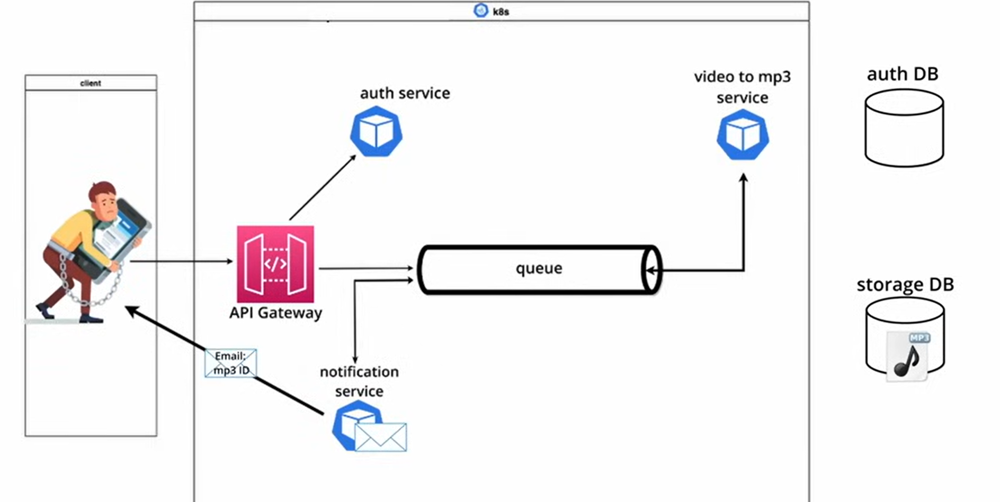

# Microservice Architecture and System Design with Python & Kubernetes



## Dependencies:

- install k9s
- install minikube
- setup flask
- pip install jwt
- install flask mysql : sudo pip3 install Flask-MySQLdb --break-system-packages
- MySQL for the auth service
- start and connect to it :
```bash
brew services start mysql
mysql -uroot
```

## Auth Service:
### 🧠 What is `request.authorization`?

`request.authorization` is a **Flask** feature that lets you easily extract credentials from the **Authorization header** in a request. It works when you're using **HTTP Basic Auth**.

#### 🔒 What’s HTTP Basic Auth?

Basic Auth is a simple way to send a **username and password** with an HTTP request. The client includes an `Authorization` header that looks like this:

```
Authorization: Basic base64(username:password)
```

For example:

- Username: `alice`
- Password: `1234`
- Combined: `alice:1234`
- Base64 encoded: `YWxpY2U6MTIzNA==`

The full header becomes:
```
Authorization: Basic YWxpY2U6MTIzNA==
```

---

### 🔍 How does Flask handle this?

When the request comes in, Flask decodes that header automatically. If you do:

```python
auth = request.authorization
```

`auth` becomes an object with:

```python
auth.username  # 'alice'
auth.password  # '1234'
```

If there's no Authorization header or it’s not in Basic format, `auth` will be `None`.

---

### 🧪 Use Case Example

Let’s say we want to protect the `/login` route with Basic Auth and only allow a specific username/password combo:

```python
from flask import Flask, request, jsonify

app = Flask(__name__)

@app.route("/login", methods=["POST"])
def login():
    auth = request.authorization
    
    # If no auth provided or wrong credentials
    if not auth or auth.username != "admin" or auth.password != "secret":
        return jsonify({"message": "Authentication failed"}), 401

    return jsonify({"message": "Welcome, admin!"}), 200
```

#### 🔐 How to test it:

Using **curl**:
```bash
curl -X POST -u admin:secret http://localhost:5000/login
```

Using **Postman**:
- Choose `POST` and URL `http://localhost:5000/login`
- Go to `Authorization` tab
- Choose `Basic Auth`
- Set username = `admin`, password = `secret`

---

### Database "auth" for our auth service

### Connect to DB and execute a query:

- use mysql.connection which is the active DB connection.
- using a cursor object (allows to execute SQL queries and retrieve results)
- A cursor in SQL is a database object used to retrieve and manipulate data row by row, rather than fetching an entire result set at once.

- resources:
    - https://dev.mysql.com/doc/connector-python/en/connector-python-api-mysqlconnection-cursor.html
    - https://flask-mysql.readthedocs.io/en/stable/

#### why **email=%s**, and not string formatting

- this uses parametrized queries:
```sql
SELECT email, password FROM user WHERE email=%s
```

- then safely passes the value as a tuple:
```python
(auth.username,)
```

- why is this better than doing:
```python
f"SELECT ... WHERE email='{auth.username}'"
```

- Because:
    * **it's safe against SQL Injection attacks**.
    * The database driver handles escaping and formatting internally.

### Gateway overview and the use of JwT tokens (Basic auth and JSON Web Tokens): 

- resources:
    - https://dev.to/jaypmedia/jwt-explained-in-4-minutes-with-visuals-g3n
    - https://stackoverflow.com/questions/37582444/jwt-vs-cookies-for-token-based-authentication
    - https://developer.mozilla.org/en-US/docs/Web/HTTP/Guides/Authentication


- Our microservices are going to be running in a k8s cluster, and that cluster internal network is not going to be accessible to or from the outside world.

- our client will be making requests from outside the cluster, with the intention of making use of our distributed system deployed within our private k8s cluster via our system's **Gateway**, so our **Gateway** service is going to be the entrypoint to the overall application, and the gateway service is going to be the service that receives requests from the client, it will be the service that communicates with the necessary internal services to fulfill the requests received from the client.

- Our **Gateway** is going to be also where we define the functionality of our overall application.

- So if our internal services live within an internal network, how to we determine when should allow requests in from the open internet? 

- This is where our auth service comes in, we can give clients access to our application, by creating credentials for them within our auth DB (User Password Combination).

- this is where the authentication scheme called **Basic Authentication** or **Basic Access Authentication** comes in...

- after success login (match in the credentials in our db), we know the user has access, and we return a JWT to the client, which the client will use for subsequent requests to our gateway's upload and download endpoints.

- for json web tokens (jwt) look the provided docs.
- Authentication scheme  bearer: **Authorization: Bearer <token>**
- encoding and decoding jwt flask resource: 
    * https://pyjwt.readthedocs.io/en/latest/usage.html#encoding-decoding-tokens-with-hs256
