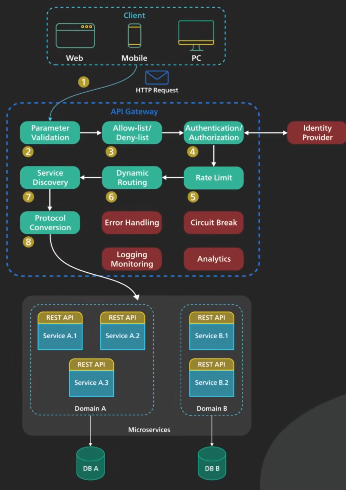
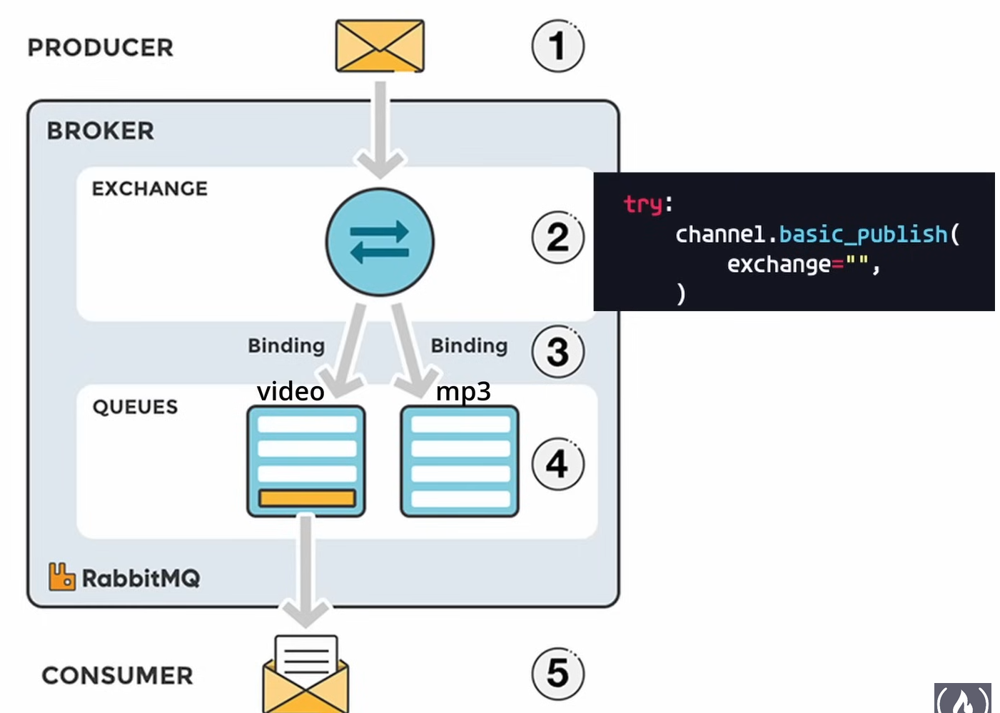
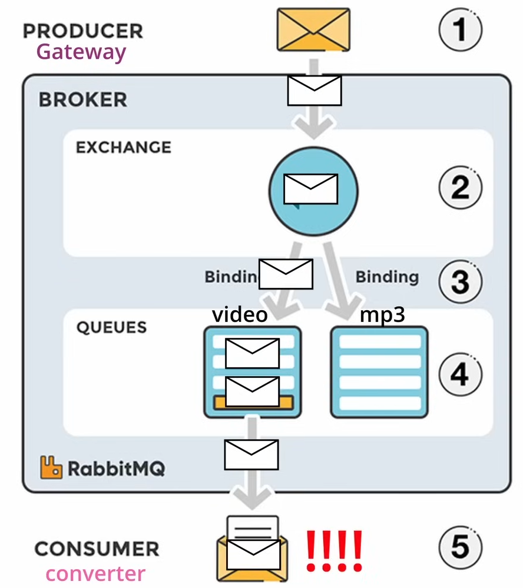
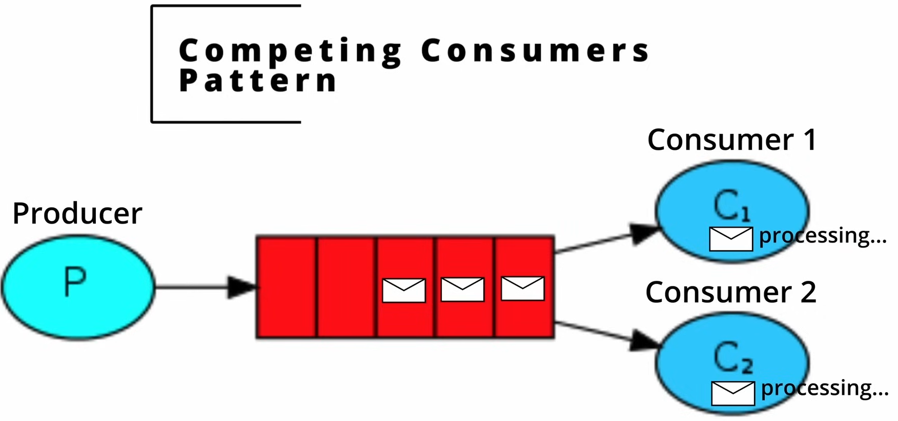
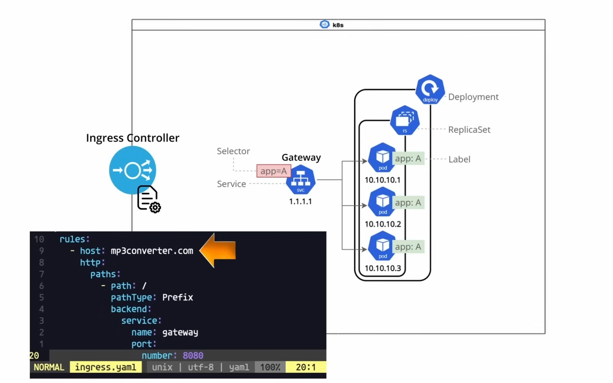

# Microservice Architecture and System Design with Python & Kubernetes


- general resource: 
    * https://www.youtube.com/watch?v=hmkF77F9TLw&t=4077s

## Dependencies:

- install k9s
- install minikube
- setup flask
- pip install jwt
- install flask mysql : sudo pip3 install Flask-MySQLdb --break-system-packages
- MySQL for the auth service
- start and connect to it :
```bash
brew services start mysql
mysql -uroot
```

## Auth Service:
### 🧠 What is `request.authorization`?

`request.authorization` is a **Flask** feature that lets you easily extract credentials from the **Authorization header** in a request. It works when you're using **HTTP Basic Auth**.

#### 🔒 What’s HTTP Basic Auth?

Basic Auth is a simple way to send a **username and password** with an HTTP request. The client includes an `Authorization` header that looks like this:

```
Authorization: Basic base64(username:password)
```

For example:

- Username: `alice`
- Password: `1234`
- Combined: `alice:1234`
- Base64 encoded: `YWxpY2U6MTIzNA==`

The full header becomes:
```
Authorization: Basic YWxpY2U6MTIzNA==
```

---

### 🔍 How does Flask handle this?

When the request comes in, Flask decodes that header automatically. If you do:

```python
auth = request.authorization
```

`auth` becomes an object with:

```python
auth.username  # 'alice'
auth.password  # '1234'
```

If there's no Authorization header or it’s not in Basic format, `auth` will be `None`.

---

### 🧪 Use Case Example

Let’s say we want to protect the `/login` route with Basic Auth and only allow a specific username/password combo:

```python
from flask import Flask, request, jsonify

app = Flask(__name__)

@app.route("/login", methods=["POST"])
def login():
    auth = request.authorization
    
    # If no auth provided or wrong credentials
    if not auth or auth.username != "admin" or auth.password != "secret":
        return jsonify({"message": "Authentication failed"}), 401

    return jsonify({"message": "Welcome, admin!"}), 200
```

#### 🔐 How to test it:

Using **curl**:
```bash
curl -X POST -u admin:secret http://localhost:5000/login
```

Using **Postman**:
- Choose `POST` and URL `http://localhost:5000/login`
- Go to `Authorization` tab
- Choose `Basic Auth`
- Set username = `admin`, password = `secret`

---

### Database "auth" for our auth service

### Connect to DB and execute a query:

- use mysql.connection which is the active DB connection.
- using a cursor object (allows to execute SQL queries and retrieve results)
- A cursor in SQL is a database object used to retrieve and manipulate data row by row, rather than fetching an entire result set at once.

- resources:
    - https://dev.mysql.com/doc/connector-python/en/connector-python-api-mysqlconnection-cursor.html
    - https://flask-mysql.readthedocs.io/en/stable/

#### why **email=%s**, and not string formatting

- this uses parametrized queries:
```sql
SELECT email, password FROM user WHERE email=%s
```

- then safely passes the value as a tuple:
```python
(auth.username,)
```

- why is this better than doing:
```python
f"SELECT ... WHERE email='{auth.username}'"
```

- Because:
    * **it's safe against SQL Injection attacks**.
    * The database driver handles escaping and formatting internally.

### Gateway overview and the use of JwT tokens (Basic auth and JSON Web Tokens): 

- resources:
    - https://dev.to/jaypmedia/jwt-explained-in-4-minutes-with-visuals-g3n
    - https://stackoverflow.com/questions/37582444/jwt-vs-cookies-for-token-based-authentication
    - https://developer.mozilla.org/en-US/docs/Web/HTTP/Guides/Authentication


- Our microservices are going to be running in a k8s cluster, and that cluster internal network is not going to be accessible to or from the outside world.

- our client will be making requests from outside the cluster, with the intention of making use of our distributed system deployed within our private k8s cluster via our system's **Gateway**, so our **Gateway** service is going to be the entrypoint to the overall application, and the gateway service is going to be the service that receives requests from the client, it will be the service that communicates with the necessary internal services to fulfill the requests received from the client.

- Our **Gateway** is going to be also where we define the functionality of our overall application.

- So if our internal services live within an internal network, how to we determine when should allow requests in from the open internet? 

- This is where our auth service comes in, we can give clients access to our application, by creating credentials for them within our auth DB (User Password Combination).

- this is where the authentication scheme called **Basic Authentication** or **Basic Access Authentication** comes in...

- after success login (match in the credentials in our db), we know the user has access, and we return a JWT to the client, which the client will use for subsequent requests to our gateway's upload and download endpoints.

- for json web tokens (jwt) look the provided docs.
- Authentication scheme  bearer: **Authorization: Bearer <token>**
- encoding and decoding jwt flask resource: 
    * https://pyjwt.readthedocs.io/en/latest/usage.html#encoding-decoding-tokens-with-hs256

### Build dockerfile

- used of cached layer to optimize the build of docker images (requirements layer before app layer). 

- pip3 freeze > requirements.txt
- build image
- use docker scan
- use of docker hub to store images
- name the repo auth (for the auth service)
- docker tag ... (tag the image)
- docker push hub_name/auth:tag

### Manifests for k8s configs

- k8s archi and interaction with k8s api.
- deployment strategies (strategy to use to replace existing pods with new ones):
    * how to know the metrics of max surge...
    * https://www.youtube.com/watch?v=lxc4EXZOOvE
    * https://medium.com/@muppedaanvesh/rolling-update-recreate-deployment-strategies-in-kubernetes-%EF%B8%8F-327b59f27202
- configMap and Secret:
    * https://www.getambassador.io/blog/kubernetes-configurations-secrets-configmaps
- use of vault:
    * https://www.vaultproject.io/use-cases/kubernetes
    * https://developer.hashicorp.com/vault/tutorials/kubernetes/vault-secrets-operator
- the manifests when applied will interface with the k8s api, which is the api for our k8s cluster, to create our components (deployment, services...)
    ```bash
    kubectl apply -f ./
    ```

## Gateway Service:



- use of NGINX as API Gateway:
    * https://medium.com/@nirmalkumar30/a-simple-guide-to-configure-nginx-as-an-api-gateway-684924cd51d0
    * https://www.solo.io/topics/nginx/nginx-api-gateway
- resource: https://www.youtube.com/watch?v=6ULyxuHKxg8
- resource: https://www.youtube.com/watch?v=JNmiOw26PGg&t=3s

- an API Gateway is a single point of entry to the clients of an application. it sits between the clients and a collection of backend services for the application. it provides:
    * Authentication and security policy enforcements.
    * load balancing and circuit breaking. 
    * protocol translation and service discovery.
    * monitoring, logging, analytics and billing.
    * caching.

## MongoDB and gridFS:

- docs: https://www.mongodb.com/docs/manual/reference/limits/
- docs: https://www.mongodb.com/docs/manual/core/gridfs/
- mongoDB used to store mp3 files and videos (BSON docs).
- gridFS divides files into parts or chunks (handle files larger than 16m by sharding the files).

## RabbitMQ (DIstributed System)

- resource: https://www.youtube.com/watch?v=7rkeORD4jSw

### Video to MP3 Microservice Architecture
---

#### Flow Description (RabbitMQ)

1. **Client Upload**:
    - A user uploads a video through the **Client App**.
    - The request is routed to the **API Gateway** (producer).
    - The **API Gateway** authenticates the user via the **Auth Service** and stores the video in **MongoDB (Storage DB)**.

2. **Queue Message #1**:
    - The API Gateway sends a message to **RabbitMQ**, indicating a new video is available for processing.

3. **Video Processing**:
    - The **Video-to-MP3 Converter Service** consumes the message from RabbitMQ.
    - It retrieves the video from **MongoDB**, converts it to MP3, and stores the MP3 back in **MongoDB**.

4. **Queue Message #2**:
    - After conversion, the service pushes a new message to RabbitMQ, stating that the MP3 is ready.

5. **Notification**:
    - The **Notification Service** consumes the "conversion complete" message.
    - It sends an email to the user containing the **MP3 ID**.

6. **Download**:
    - The user sends a request with the **MP3 ID** and **JWT** to the API Gateway.
    - The **API Gateway** authenticates the user and fetches the MP3 from **MongoDB**, then returns it to the client.

---

#### Components

- **Client**
- **API Gateway**
- **Auth Service**
- **RabbitMQ**
- **Video to MP3 Service**
- **Notification Service**
- **Auth DB**
- **Storage DB (MongoDB)**

---

#### ASCII Architecture Flow

```
              ┌────────────┐
              │   Client   │
              └────┬───────┘
                   │
         Upload Video (JWT + file)
                   ▼
           ┌──────────────┐
           │ API Gateway  │
           └────┬──┬──────┘
                │  │
      Auth Req. │  └─────> Put message on RabbitMQ
                ▼
        ┌────────────┐
        │ Auth Svc   │
        └────┬───────┘
             ▼
       ┌──────────┐
       │ Auth DB  │
       └──────────┘

--- Queue Triggered Processing ---

           ┌────────────────────────┐
           │ Video to MP3 Service   │◄─────────────┐
           └─────────┬──────────────┘              │
                     ▼                             │
              ┌────────────┐                       │
              │ Storage DB │ (Video & MP3)         │
              └────┬───────┘                       │
                   │                               │
        Convert Video to MP3                       │
                   ▼                               │
      Push "conversion done" message ──────────────┘

--- Notification Stage ---

           ┌────────────────────┐
           │ Notification Svc   │◄─────────────┐
           └──────────┬─────────┘              │
                      ▼                        │
             Email MP3 ID to Client            │
                                               │
--- Client Downloads MP3 ----------------------┘

              ┌────────────┐
              │   Client   │
              └────┬───────┘
                   │
       Request MP3 (JWT + mp3_id)
                   ▼
           ┌──────────────┐
           │ API Gateway  │
           └────┬─────────┘
                ▼
           ┌────────────┐
           │ Storage DB │
           └────┬───────┘
                ▼
          MP3 file returned
```

---

## Key Concepts for the architeture :

* Asynchronous and Synchronous Interservice Communication.
* Strong and Eventual Consistency.

---

### Synchronous Interservice Communication

> **Synchronous communication** occurs when the **calling service waits (blocks)** for a response from the **called service** before proceeding.

- In this model, the **client service is blocked** and **cannot continue** other tasks until it receives a response.
- This form of communication is **blocking** in nature.
- In our system, the **API Gateway communicates synchronously with the Auth Service**.
- For instance, when a user logs in:
  - The **Gateway** sends an **HTTP POST request** to the **Auth Service**.
  - The **Gateway is blocked** until the **Auth Service responds** with a **JWT** or an **error**.
- This creates **tight coupling** between the two services.

**Key Takeaways**:
- **Blocking call**
- Gateway <-> Auth Service
- Tightly coupled interaction

---

#### ASCII Diagram

```
[ Client ]
    │
    ▼
[ API Gateway ]
    │  HTTP POST (login)
    ▼
[ Auth Service ]
    │     ▲
    │     │
    └─────┘
   Wait for response
```

> The API Gateway waits (blocks) here until the Auth Service responds.

---

### Asynchronous Interservice Communication

> **Asynchronous communication** allows the calling service to continue its tasks without waiting for a response from the downstream service — this is called **non-blocking** communication.

- In your architecture, this is achieved using a **message queue**.
- For example:
  - The **API Gateway** needs to communicate with the **Converter Service**.
  - If done synchronously, the **Gateway would be blocked**, especially when processing large videos or handling multiple requests.
- Instead, the **Gateway pushes a message to the queue**, and the **Converter Service consumes it later**.
- This design means:
  - The **Gateway and Converter Service are loosely coupled**.
  - The **Gateway doesn’t wait** for a response — it performs a **"fire-and-forget"** action.
  - Similarly, once conversion is done, the **Converter Service pushes another message** to the queue for the **Notification Service**, continuing the **asynchronous flow**.

**Key Takeaways**:
- Non-blocking requests
- Queue-based decoupling
- Gateway ↔ Converter ↔ Notification via queue
- Loose coupling between services

---

#### ASCII Diagram

```
[ Client ]
    │
    ▼
[ API Gateway ]
    │
    ├──► Store video in MongoDB
    │
    └──► Push message to Queue ─────► [ Converter Service ]
                                          │
                                          ├──► Pull video from MongoDB
                                          ├──► Convert to MP3
                                          └──► Push message to Queue ───► [ Notification Service ]
                                                                                │
                                                                                └──► Send Email
```

> Messages are pushed to the queue, and services process them **asynchronously** when they are ready.

---

### Strong Consistency:
### Eventual Consistency:

## Gateway Logic:

- flask routing resources:
    * https://flask.palletsprojects.com/en/stable/quickstart/
- auth resources:
    * https://developer.mozilla.org/en-US/docs/Web/HTTP/Reference/Headers/Authorization
    * https://beeceptor.com/docs/concepts/authorization-header/
- **from flask import request**: request is a global proxy provided by Flask that gives you access to the incoming HTTP request data.
- login route to communicate with auth service after client want to login.
- **__init__.py** in auth_svc to mark the directory as a package.
- use of **requests** package to make HTTP request between the gateway and the auth service.
- for the upload service, we need to make sure the user has a token from the login route so he can have access to upload.
- as the flow suggests, the client's going to access our internal services or our endpoints by first logging in and getting a JWT and then for all subsequent requests the client is going to have an authorization header containing that JWT which tells our API Gateway that that client has access to the endpoints of our overall application.
- in the createJWT function, we are encoding a payload that contains our claims:
```python
return jwt.encode(
        {
            "username": username,
            "exp": datetime.datetime.now(tz=datetime.timezone.utc)
            + datetime.timedelta(days=1),
            "iat": datetime.datetime.now(datetime.timezone.utc),
            # user is admin or not
            "admin": authz,
        },
        secret,
        algorithm="HS256",
    )
```
- the token return to the logged in client is going to contain this payload but the payload is going to be encoded, and when that client sends their token in their request and we validate it, we first check if the token exist in the request, and then we are going to decode that token, and when we're decoding the token we're using the same key that we signed the token with this JWT secret, which is how we know that this is a valid token because our auth service is the service that signed the token using this key, and when we decode the token we're using the same key,  so if somebody were to send a token that was signed with a different secret key then of course it wouldn't work.
- Serialization and Deserialization, and Json manipulation with python:
    * https://www.baeldung.com/cs/serialization-deserialization
    * https://hazelcast.com/foundations/distributed-computing/serialization/
    * https://www.geeksforgeeks.org/serialization-in-java/
    * https://www.geeksforgeeks.org/json-loads-in-python/
    * https://docs.python.org/3/library/json.html
- in the upload:
    * **request.files** is a dictionary-like object containing all uploaded files, refers to the part of an incoming HTTP request that contains uploaded files.
    * The keys are the names of the file input fields in the HTML form.
    * The values are the actual uploaded file objects.
    * resource for file uploads:
        * https://flask.palletsprojects.com/en/stable/patterns/fileuploads/

### Upload logic:

- **Client uploads a video** via the Gateway service.
- **Gateway stores the file in MongoDB** using **GridFS**.
- Once upload is successful:
  - **Gateway puts a message into RabbitMQ**.
- This message contains the **ID of the uploaded video** in MongoDB.
- A **downstream service (e.g., Converter Service)** will:
  - Pull the message from RabbitMQ,
  - Use the ID to **retrieve the video from MongoDB**,
  - Process it (e.g., convert to MP3).
- This setup allows for **asynchronous communication**.
- **Gateway doesn’t wait** for the conversion to finish — it just **“sends and forgets”**.
- The Gateway can **immediately return a response** to the client after uploading.

---

#### ASCII Diagram of the Flow

```
[ Client ]
    │
    ▼
[ Gateway Service ]
    │
    ├──► Upload video to MongoDB (via GridFS)
    │
    └──► Push message (video ID) to RabbitMQ
                                  │
                                  ▼
                       [ Converter Service ]
                            │
                            ├──► Pull message from queue
                            ├──► Retrieve video from MongoDB
                            └──► Convert video to MP3
```

---

* use gridFS to write data to our mongodb database (uplaod the video to the db):
    - https://pymongo.readthedocs.io/en/stable/examples/gridfs.html

#### Rabbitmq in our archi:



- producer (gatewat): the service that send the message through an exchange and not directly putting the message on the queue. The exchange is the middleman that allocates messages to their correct queue (we have more than one queue, one for videos and one for mp3s). 
- How does the exchange routes the messages to the correct queue: 
    - in our setup we are using the **Default Exchange**
    - docs: https://www.rabbitmq.com/tutorials/amqp-concepts#exchange-default
---

#### Extended Flow: Video Upload → MP3 Conversion → MP3 Queue Message

- **Producer**: Gateway Service
- **Broker**: RabbitMQ (with Exchange, Bindings, Queues)
- **Consumer 1**: Video-to-MP3 Converter
- **Consumer 2**: (Could be a downstream service like Notification Service)

---

#### Step-by-Step Flow

1. The **Gateway service** receives a video file from the user.
2. The Gateway stores the video in **MongoDB**.
3. It publishes a **message to the Exchange** (e.g., `video_exchange`).
4. The Exchange **routes the message** to the **video queue** via binding.
5. The **Video-to-MP3 converter service** consumes the message from the **video queue**.
6. The converter:
   - Pulls the video from MongoDB.
   - Converts it to MP3.
   - Stores the MP3 in MongoDB.
7. Then it **publishes a new message** to the **Exchange** for the **mp3 queue**.
8. The Exchange routes the MP3 message to the **mp3 queue**.
9. A **downstream consumer** (e.g., Notification or Storage Service) consumes from the **mp3 queue**.

---

```
[ User ]
   │
   ▼
[ Gateway Service ]
   │
   ├──► Store video in MongoDB
   └──► Publish message to Exchange (video)
                      │
                      ▼
         +---------------------------+
         |        RabbitMQ           |
         |     [Exchange Layer]      |
         +-------------+-------------+
                       |
              Bindings (Routing)
              /                   \
      [video queue]         [mp3 queue]
            │                    │
            ▼                    ▼
[ Video-to-MP3 Converter ]   [MP3 Consumer]
      │                           │
      ├─► Pull video from MongoDB │
      ├─► Convert to MP3          │
      ├─► Store MP3 in MongoDB    │
      └─► Publish message to Exchange (mp3)
```

#### Issue: overloading the queue with messages:



- **Solution**: scale up the video to mp3 consumer.
- **Issue**: our queue actually needs to be able to accommodate multiple instances of our consumer without bottlenecking the entire flow.
- **Solution**: Use of the **Competing Consumers Pattern**.



---

#### Competing Consumers Pattern

The **Competing Consumers** pattern is a common and powerful design in message-based systems like RabbitMQ. It allows multiple consumers to concurrently process messages from the same queue, significantly improving system **throughput** and **scalability**.

---

##### How It Works

1. A **Producer** publishes messages to a **queue**.
2. Multiple **Consumer instances** (e.g., C₁, C₂) subscribe to the same queue.
3. RabbitMQ uses a **round-robin algorithm** to distribute messages:
   - The first message goes to Consumer 1.
   - The second message goes to Consumer 2.
   - The third message goes back to Consumer 1.
   - And so on...

This ensures that messages are **evenly distributed** across all available consumers, allowing them to **process in parallel**.

---

##### Why Use This Pattern?

- **Parallelism**: Messages are processed concurrently by multiple consumers.
- **Scalability**: Add more consumer instances to handle higher message volume.
- **Load Balancing**: RabbitMQ handles distribution automatically via round-robin.
- **Performance Boost**: Increases throughput and reduces latency in high-traffic systems.

---

##### Round-Robin Distribution in Action

If you have a queue packed with messages and **two consumer instances**, RabbitMQ will dispatch them like this:

```
Queue:
[ Msg1 ] -> Consumer 1
[ Msg2 ] -> Consumer 2
[ Msg3 ] -> Consumer 1
[ Msg4 ] -> Consumer 2
...
```

This rotation helps prevent any one consumer from being overwhelmed while others are idle.

---

##### Use Cases

- Video processing pipelines  
- Background job workers  
- API request handlers  
- Email notification dispatchers  
- Data processing tasks in microservices  

- resources: 
    - https://www.rabbitmq.com/tutorials/tutorial-three-python
    - https://www.rabbitmq.com/tutorials/tutorial-two-python
---

#### Queue and Message Persistance in RabbitMQ and K8S:

- **Message Persistence in Case of Pod Failures**:
  - The goal is to **ensure that messages are persisted** (saved and not lost) in RabbitMQ queues, even if the pod crashes or is restarted in a Kubernetes cluster.
  
- **Stateful Pod in Kubernetes**:
  - The RabbitMQ pod is a **stateful pod**, meaning it stores persistent data. In Kubernetes, this type of pod retains data across restarts, unlike stateless pods, which lose their data after a restart.
  
- **Need for Persistent Messages**:
  - If the pod crashes or restarts, you want the messages in the queue to **survive** this failure, so when the pod restarts, the messages are still available for processing.

- **Queue Durability**:
  - To ensure the messages are retained after a restart, you need to make the **queue durable**. This ensures that the queue will exist even after a pod restart, but **does not automatically persist the messages** inside the queue.

- **Message Durability**:
  - **Durable queues alone don't guarantee message persistence**. Even if the queue itself survives a restart, without setting message durability, the messages inside the queue might be lost.
  - To prevent message loss, each **individual message** must be marked as durable. This ensures that the messages are stored on disk and **survive a pod crash or restart**.

- **Configuration**:
  - When creating the queue, you configure it to be durable, but you must also explicitly tell RabbitMQ to persist the messages themselves by setting the appropriate flag (e.g., `delivery_mode=pika.spec.PERSISTENT_DELIVERY_MODE`).

- **Key Point**:
  - Both **queue durability** (queue survives restarts) and **message durability** (messages survive even if the pod crashes or is restarted) are needed to ensure no message loss in the event of failures.
- resources:
    - https://www.rabbitmq.com/docs/persistence-conf
    - https://www.cloudamqp.com/blog/faq-what-is-the-delivery-mode-in-amqp.html
    - https://stackoverflow.com/questions/2344022/what-is-the-delivery-mode-in-amqp

---

## Gateway Deployment:

- The service of the gateway will be of type **Cluster IP**, meaning it will have an internal IP address which will only be available within our cluster but our Gateway API needs to be able to be accessed from outside of our cluster so we're actually going to need to create another configuration called an Ingress to Route traffic to our actual Gateway service.



```yaml
Client Request: http://mp3converter.com/upload
            |
        Ingress (routes to `gateway` service)
            |
     Service: gateway (ClusterIP)
            |
         Pod(s) labeled app=gateway (on port 8080)

```